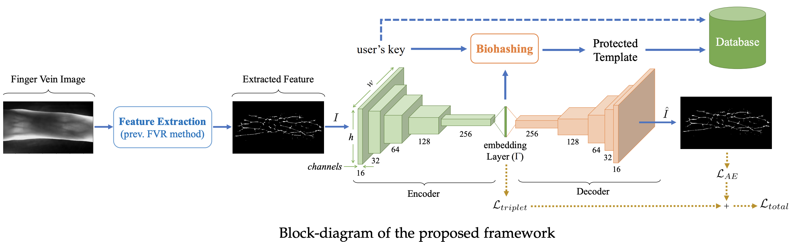

# Towards Protecting and Enhancing Vascular Biometric Recognition methods via Biohashing and Deep Neural Networks



This package is part of the signal-processing and machine learning toolbox
[Bob](https://www.idiap.ch/software/bob). It contains the source code to reproduce the following paper:

```
@article{TBIOM2021_ProtectVascularBiohashDNN,
  title={Towards Protecting and Enhancing Vascular Biometric Recognition methods via Biohashing and Deep Neural Networks},
  author={Shahreza, Hatef Otroshi and Marcel, S{\'e}bastien},
  journal={IEEE Transactions on Biometrics, Behavior, and Identity Science},
  year={2021},
  publisher={IEEE},
  volume={3},
  number={3},
  pages={394-404},
  doi={10.1109/TBIOM.2021.3076444}
}
```

If you use this package and/or its results, please cite both the package and [the corresponding paper](https://ieeexplore.ieee.org/abstract/document/9419051).  Also, please ensure that you include the two original Bob references in your citations.

**NOTE:** 
In the instructions that follow, the use of `< ... >` inside file paths indicates that you must replace the part enclosed within `<` and `>` with the appropriate value.  For example `<path_to_your_working_directory>` indicates that you should replace this part with the full path to the directory inside which you are running this code.  


## Installation

The experiments can only be executed on a Linux 64-bit machine.
Install [conda](https://conda.io) and run the steps below::
```
$ git clone https://gitlab.idiap.ch/bob/bob.paper.tbiom2021_protect_vascular_dnn_biohash.git
$ cd bob.paper.tbiom2021_protect_vascular_dnn_biohash
$ conda create -n TBIOM2021_ProtectVacularBiohashDNN --file package-list.txt
$ conda activate TBIOM2021_ProtectVacularBiohashDNN
```


## Downloading the Databases

The next thing you must do is to download the databases used in our experiments:

1. **UTFVP Fingervein Dataset:**  Please refer to the [this link](https://www.utwente.nl/en/eemcs/dmb/downloads/utfvp/) to download this database.
2. **PUT Vein Dataset:**  Please refer to the [this link](http://biometrics.put.poznan.pl/vein-dataset/) to download this database.
3. **VeraFinger Dataset:**  Please refer to the [this link](https://www.idiap.ch/en/dataset/vera-fingervein) to download this database.

Take note of the directory in which you have stored the downloaded database.  Then, create a textfile named `.bob_bio_databases.txt` and **store it in your home directory.**  Inside this textfile, insert the following line:

```
[YOUR_UTFVP_DIRECTORY] = <path_to_utfvp_database>
[YOUR_PUTVEIN_IMAGE_DIRECTORY] = <path_to_putvein_database>
[YOUR_VERAFINGER_DIRECTORY] = <path_to_verafinger_database>
```

Make sure you replace `<path_to_utfvp_database>`, `<path_to_putvein_database>`, and `<path_to_verafinger_database>` with the path to your downloaded  datasets.


***


## Running the Experiments
You are now ready to run the experiments to reproduce the results in the paper.  Experiments for each dataset are descibed separately:

### 1. Experiemnts on UTFVP Dataset:

#### [UTFVP] Step 1: Preparing data for training (Data Augmentation)
In order to prepare the data for training the neural network you need to run `data.py` in `data` directory:
```
$ cd UTFVP
$ cd data
$ ./task.sh
```
**NOTE:** If you are at Idiap, you can use `task_idiap.sh` to run on the grid.

**NOTE:** In `data` directory, there is a Jupyter notebook `Sample_Image.ipynb`, which contains the code to generate images used in figure 1 of the paper.

#### [UTFVP] Step 2: Training Deep Auto-Encoders
Now that the data is ready, we can train our DNN. For this end, run the following code:
```
$ cd UTFVP
$ ./train_dnns.sh
```

#### [UTFVP] Step 3: Executing different finger vein recognition methods
We can execute different finger vein recognition methods including WLD, WLD+PCA, , WLD+Biohash, MC, MC+PCA, MC+Biohash, RLT, RLT+PCA, RLT+Biohash and our trained AE+Biohash [the proposed method] by runnung the following script:
```
$ cd UTFVP
$ ./execute_fvr.sh
```

#### [UTFVP] Step 4: Evaluation
The `UTFVP/evaluation` folder contains bash files and Jupyter Notebooks to generate the plots and values in the tables. The tree of the files in this folder is as below:
```
├── FVR
│   ├── alpha
│   │   └── eval.sh
│   ├── eval.sh
│   └── TSNE.ipynb
└── Protect_Enhace_prevFVR
    ├── ablation
    │   ├── alpha
    │   │   └── eval.sh
    │   ├── Bhsh_lngth
    │   │   ├── eval.sh
    │   │   └── LowerBand
    │   │       └── eval.sh
    │   └── emb
    │       └── eval.sh
    ├── Exp1_compare
    │   ├── EER.ipynb
    │   ├── eval-100.sh
    └── TSNE
        └── TSNE.ipynb
```
You can run each of the bash files or Jupyter Notebooks to generate the results.

***


### 2. Experiemnts on PUT Vein Dataset:

#### 2.1. PUT Vein Wist Dataset

##### [PUT-wist] Step 1: Preparing data for training (Data Augmentation)
In order to prepare the data for training the neural network you need to use `Data.ipynb` in `data` directory. You can also run `feats.py` file after you generated `palm_all_imgs_aug.npy` using `Data.ipynb`:
```
$ cd PUT
$ cd PUT-wist
$ cd data
$ python feats.py
```

**NOTE:** If you are at Idiap, you can use `task_idiap.sh` to run on the grid after you generated `palm_all_imgs_aug.npy` using `Data.ipynb`:
```
$ cd PUT
$ cd PUT-wist
$ cd data
$ ./task_idiap.sh
```

##### [PUT-wist] Step 2: Training Deep Auto-Encoders
Now that the data is ready, we can train our DNN. For this end, run the following code:
```
$ cd PUT
$ cd PUT-wist
$ ./train_dnns.sh
```

##### [PUT-wist] Step 3: Executing different finger vein recognition methods
We can execute different finger vein recognition methods including WLD, WLD+PCA, , WLD+Biohash, MC, MC+PCA, MC+Biohash, RLT, RLT+PCA, RLT+Biohash and our trained AE+Biohash [the proposed method] by runnung the following script:
```
$ cd PUT
$ cd PUT-wist
$ ./execute_fvr.sh
```

##### [PUT-wist] Step 4: Evaluation
You can run the  bash file to generate the ROC plot and evaluation metrics:
```
$ cd PUT
$ cd PUT-wist
$ cd evaluation/Protect_Enhace_prevFVR/Exp1_compare
$ ./eval.sh
```

***

#### 2.2. PUT Vein Palm Dataset

##### [PUT-palm] Step 1: Preparing data for training (Data Augmentation)
In order to prepare the data for training the neural network you need to use `Data.ipynb` in `data` directory. You can also run `feats.py` file after you generated `palm_all_imgs_aug.npy` using `Data.ipynb`:
```
$ cd PUT
$ cd PUT-palm
$ cd data
$ python feats.py
```

**NOTE:** If you are at Idiap, you can use `task_idiap.sh` to run on the grid after you generated `palm_all_imgs_aug.npy` using `Data.ipynb`:
```
$ cd PUT
$ cd PUT-palm
$ cd data
$ ./task_idiap.sh
```

##### [PUT-palm] Step 2: Training Deep Auto-Encoders
Now that the data is ready, we can train our DNN. For this end, run the following code:
```
$ cd PUT
$ cd PUT-palm
$ ./train_dnns.sh
```

##### [PUT-palm] Step 3: Executing different finger vein recognition methods
We can execute different finger vein recognition methods including WLD, WLD+PCA, , WLD+Biohash, MC, MC+PCA, MC+Biohash, RLT, RLT+PCA, RLT+Biohash and our trained AE+Biohash [the proposed method] by runnung the following script:
```
$ cd PUT
$ cd PUT-palm
$ ./execute_fvr.sh
```

##### [PUT-palm] Step 4: Evaluation
You can run the  bash file to generate the ROC plot and evaluation metrics:
```
$ cd PUT
$ cd PUT-palm
$ cd evaluation/Protect_Enhace_prevFVR/Exp1_compare
$ ./eval.sh
```

***


### 3. Experiemnts on VERA Finger Dataset:

#### [VERAFinger] Step 1: Preparing data for training (Data Augmentation)
In order to prepare the data for training the neural network you need to use `Data.ipynb` in `data` directory.

**NOTE:** If you are at Idiap, you can use `task_idiap.sh` to use grid to extract WLD, RLT, and MC features after you generated the augmented data using `Data.ipynb`.
```
$ cd VERAFinger
$ cd data
$ ./task_idiap.sh
```

#### [VERAFinger] Step 2: Training Deep Auto-Encoders
Now that the data is ready, we can train our DNN. For this end, run the following code:
```
$ cd VERAFinger
$ ./train_dnns.sh
```

#### [VERAFinger] Step 3: Executing different finger vein recognition methods
We can execute different finger vein recognition methods including WLD, WLD+PCA, , WLD+Biohash, MC, MC+PCA, MC+Biohash, RLT, RLT+PCA, RLT+Biohash and our trained AE+Biohash [the proposed method] by runnung the following script:
```
$ cd VERAFinger
$ ./execute_fvr.sh
```

#### [VERAFinger] Step 4: Evaluation
You can run the  bash file to generate the ROC plot and evaluation metrics:
```
$ cd VERAFinger/evaluation/Protect_Enhace_prevFVR/Exp1_compare
$ ./eval.sh
```


## Contact
For questions or reporting issues to this software package, contact our
development [mailing list](https://www.idiap.ch/software/bob/discuss).